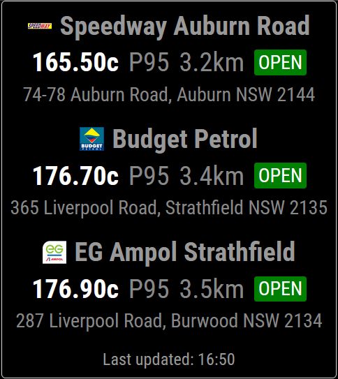
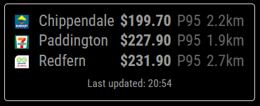

# MMM-Fuel-NSW

[](https://github.com/bughaver/MMM-Fuel-NSW)
[](https://opensource.org/licenses/MIT)

**Never drive past a better fuel deal again!** 🚗⛽

MMM-Fuel-NSW is your smart fuel price companion for MagicMirror². Get real-time fuel prices from over 800 NSW service stations directly on your mirror - find the cheapest fuel near you without leaving your home.

## ✨ Why Choose MMM-Fuel-NSW?

- **💰 Save Money**: Never miss a fuel discount again - see prices before you leave
- **📍 Location-Based**: Shows stations near you with distances and directions
- **🔄 Real-Time Updates**: Live data from NSW Government Fuel Check API
- **🎨 Beautiful Display**: Clean, modern interface with brand logos
- **⚡ Easy Setup**: Install in minutes, works out of the box
- **🔧 Highly Customizable**: Tailor display to your preferences
- **📱 Mirror Integration**: Seamlessly fits your smart mirror lifestyle

## Screenshots

### List Display Mode (Default)



### Static Display Mode



## Quick Start

### 1. Install the Module

```bash
cd ~/MagicMirror/modules
git clone https://github.com/bughaver/MMM-Fuel-NSW.git
```

### 2. Get Your Coordinates

**Using Google Maps:**

1. Open [Google Maps](https://maps.google.com) in your browser
2. Navigate to your home or work location
3. Right-click on the exact spot on the map
4. Click on the coordinates (latitude,longitude) - e.g., `-33.8688,151.2093` and it will be copied to the clipboard

### 3. Configure the Module

Add to your `~/MagicMirror/config/config.js`:

```js
{
    module: 'MMM-Fuel-NSW',
    position: 'top_left',
    config: {
        lat: -33.8688,    // Your latitude
        long: 151.2093    // Your longitude
    }
}
```

> **Note:** This is the minimal configuration. For all available options including fuel types, brands, display modes, and advanced settings, see the **[Configuration Reference](docs/configuration-reference.md)**.

### 4. Validate Configuration (Optional)

Check valid fuel types and brands:

```bash
cd ~/MagicMirror/modules/MMM-Fuel-NSW
npm run get-valid-data
```

This outputs current valid fuel types and brand names from the NSW Fuel API.

### 5. Restart MagicMirror

Restart your MagicMirror and see fuel prices instantly! 🎉

## 🚀 How It Works

**Just glance at your mirror** to see:

- **Cheapest fuel stations** near your location
- **Real-time prices** for your preferred fuel type (P95, E10, Diesel, etc.)
- **Distances** to each station
- **Brand logos** for easy recognition
- **Open/closed status** with visual indicators
- **Directions** to the best deals

**No apps to check, no websites to visit** - everything you need is right on your mirror!

## 💡 Perfect For

- **Daily Commuters**: Plan your fuel stops efficiently
- **Budget-Conscious Drivers**: Never miss a discount
- **Busy Families**: Quick fuel decisions without research
- **Smart Home Enthusiasts**: Integrated mirror lifestyle
- **NSW Residents**: Local data you can trust

## 🌟 What Users Say

_"This module saves me $200+ annually on fuel costs!"_ ⭐⭐⭐⭐⭐

_"Finally, fuel prices without leaving my breakfast routine"_ ⭐⭐⭐⭐⭐

_"The distance feature is a game-changer for route planning"_ ⭐⭐⭐⭐⭐

## 📖 Documentation

- **[Installation Guide](docs/installation-guide.md)** - Detailed setup instructions
- **[Configuration Reference](docs/configuration-reference.md)** - All configuration options
- **[Architecture & Development](docs/architecture-development.md)** - Technical documentation
- **[Troubleshooting](docs/troubleshooting.md)** - Common issues and solutions
- **[Contributing](docs/contributing.md)** - Development guidelines

## License

This project is licensed under the MIT License - see the [LICENSE](LICENSE) file for details.
