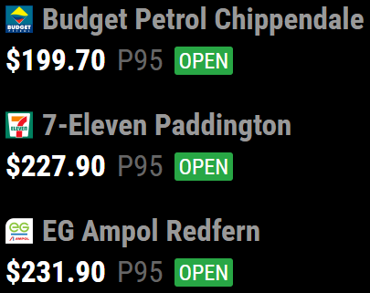
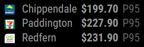

# MMM-Fuel-NSW

A MagicMirror² module to display fuel prices from New South Wales, Australia, using data from the NSW Fuel Check API.

## Installation

### Install

In your terminal, go to the modules directory and clone the repository:

```bash
cd ~/MagicMirror/modules
git clone https://github.com/bughaver/MMM-Fuel-NSW.git
```

### Update

Go to the module directory and pull the latest changes:

```bash
cd ~/MagicMirror/modules/MMM-Fuel-NSW
git pull
```

## Screenshots

### List Display Mode (Default)

Shows detailed fuel price information in a list format with brand logos, distances, and status indicators.




### Static Display Mode

Compact table format perfect for dashboard-style layouts. Prices are displayed in red when stations are closed and orange when closing soon (within 1 hour).




## Configuration

To use this module, you have to add a configuration object to the modules array in the `config/config.js` file.

### Example configuration

Minimal configuration to use the module (requires location coordinates):

```js
    {
        module: 'MMM-Fuel-NSW',
        position: 'top_left',
        config: {
            lat: -33.8688,
            long: 151.2093
        }
    },
```

Alternative minimal configuration using bounding box coordinates:

```js
    {
        module: 'MMM-Fuel-NSW',
        position: 'top_left',
        config: {
            bottomLeftLatitude: -33.9,
            bottomLeftLongitude: 151.1,
            topRightLatitude: -33.8,
            topRightLongitude: 151.3
        }
    },
```

Configuration with all options:

```js
    {
        module: 'MMM-Fuel-NSW',
        position: 'top_left',
        config: {
            fuelType: 'P95',
            brands: ['Caltex', 'Shell'],
            radius: 5,
            sortBy: 'price',
            limit: 10,
            lat: -33.8688,
            long: 151.2093,
            updateIntervalInSeconds: 600,
            maxWidth: '400px',
            showDistance: true,
            showAddress: false,
            showLogo: true,
            showOpenStatus: true,
            showFuelType: true,
            alignment: 'center',
            borderStyle: 'all',
            showLastUpdate: true,
            displayMode: 'list'
        }
    },
```

### Configuration options

| Option                    | Possible values                   | Default     | Description                                                                           |
| ------------------------- | --------------------------------- | ----------- | ------------------------------------------------------------------------------------- |
| `fuelType`                | `string` (e.g., 'P95', 'E10')     | `'P95'`     | Fuel type to display prices for                                                       |
| `brands`                  | `array` of strings                | `[]`        | Specific fuel brands to include (empty array = all brands)                            |
| `radius`                  | `number` (km)                     | `3`         | Search radius around the specified location                                           |
| `sortBy`                  | `'price'` or `'distance'`         | `'price'`   | Sort stations by price or distance                                                    |
| `limit`                   | `number`                          | `3`         | Maximum number of stations to display                                                 |
| `lat`                     | `number`                          | `undefined` | Latitude of search center (required if not using bounding box)                        |
| `long`                    | `number`                          | `undefined` | Longitude of search center (required if not using bounding box)                       |
| `bottomLeftLatitude`      | `number`                          | `undefined` | Alternative: bottom-left latitude of bounding box                                     |
| `bottomLeftLongitude`     | `number`                          | `undefined` | Alternative: bottom-left longitude of bounding box                                    |
| `topRightLatitude`        | `number`                          | `undefined` | Alternative: top-right latitude of bounding box                                       |
| `topRightLongitude`       | `number`                          | `undefined` | Alternative: top-right longitude of bounding box                                      |
| `updateIntervalInSeconds` | `number` (>=120)                  | `600`       | How often to update fuel prices (minimum 120 seconds)                                 |
| `maxWidth`                | `string` (CSS width)              | `'100%'`    | Maximum width of the module                                                           |
| `showDistance`            | `boolean`                         | `true`      | Show distance to each station                                                         |
| `showAddress`             | `boolean`                         | `true`      | Show full address of each station                                                     |
| `showLogo`                | `boolean`                         | `true`      | Show brand logos                                                                      |
| `showOpenStatus`          | `boolean`                         | `true`      | Show open/closed/closing soon status                                                  |
| `showFuelType`            | `boolean`                         | `true`      | Show the fuel type (e.g., P95, E10) next to the price                                 |
| `alignment`               | `'left'`, `'center'`, `'right'`   | `'center'`  | Text alignment for list mode: left-aligned, centered, or right-aligned                |
| `borderStyle`             | `'none'`, `'individual'`, `'all'` | `'all'`     | Border style: none, individual boxes around each station, or box around entire module |
| `showLastUpdate`          | `boolean`                         | `true`      | Show the last update time at the bottom of the module                                 |
| `displayMode`             | `'list'`, `'static'`              | `'list'`    | Display mode: detailed list format or compact static line format                      |

## Valid Fuel Types and Brands

To configure the module with valid fuel types and brands, you can use the built-in NPM script to fetch the current valid options from the NSW Fuel Check API:

```bash
npm run get-valid-data
```

This will output a JSON object containing:

- `fuelTypes`: Array of valid fuel type codes (e.g., "P95", "E10", "DL")
- `brands`: Array of valid brand names (e.g., "Caltex", "Shell", "BP")

Example output:

```json
{
  "fuelTypes": ["E10-U91", "E10", "U91", "E85", "P95-P98", "P95", "P98", "DL-PDL", "DL", "PDL", "B20", "EV", "LPG", "LNG", "H2", "CNG"],
  "brands": ["7-Eleven", "AGL", "APCO", "Ampol", "BP", "Caltex", "Coles Express", "Shell", ...]
}
```

Use these values in your module configuration for the `fuelType` and `brands` options.

### Getting Latitude and Longitude

To find the latitude and longitude coordinates for your location, you can use Google Maps:

1. Open [Google Maps](https://maps.google.com) in your web browser
2. Navigate to your desired location (home, work, etc.)
3. Right-click on the exact location on the map
4. Clicking the `latitude, longitude` (e.g., `-33.8688, 151.2093`) we'll copy it to your clipboard

Use these coordinates for the `lat` and `long` configuration options in your module setup.

## Features

- Real-time fuel prices from NSW Fuel Check API
- Customizable fuel types (P95, E10, etc.)
- Filter by specific fuel brands
- Sort by price or distance
- Visual indicators for open/closed/closing soon status
- Brand logos display
- Configurable update intervals
- Responsive design

## Developer commands

- `npm install` - Install dependencies
- `npm run build` - Build the module from TypeScript sources
- `npm run dev` - Build with source maps for development
- `npm run dev:watch` - Watch mode for development
- `npm run lint` - Run linting and formatter checks
- `npm run lint:fix` - Fix linting and formatter issues
- `npm test` - Run tests

## License

This project is licensed under the MIT License - see the [LICENSE](LICENSE) file for details.

## Changelog

All notable changes to this project will be documented in the [CHANGELOG.md](CHANGELOG.md) file.
